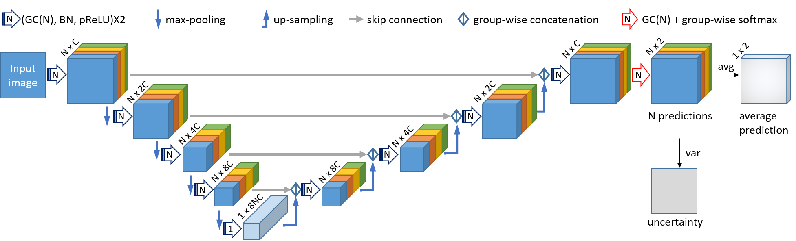
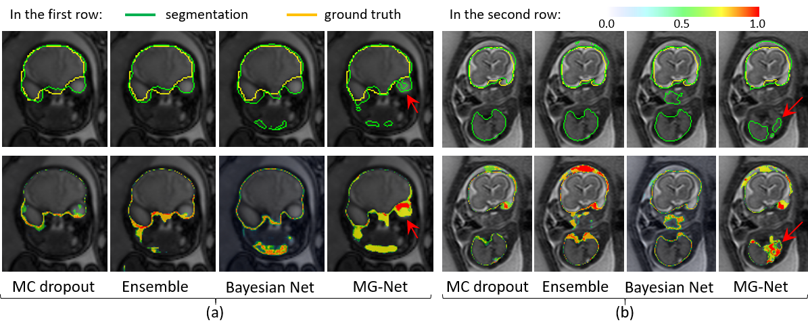
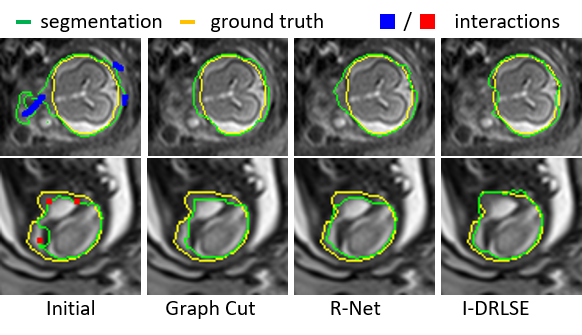

# UGIR: Uncertainty-Guided Interactive Refinement for Segmentation
This repository will provide the code for "Uncertainty-Guided Efficient Interactive Refinement of Fetal Brain Segmentation from Stacks of MRI Slices" accepted by MICCAI 2020. The code will be uploaded soon.

The code contains two modules: 1), a novel CNN based on convolution in Multiple Groups (MG-Net) that simultaneously obtains an intial segmentation and its uncertainty estimation. 2), Interaction-based level set for fast refinement, which is an extention of the DRLSE algorithm and named as I-DRLSE. 

Structure of MG-Net.

Segmentation with uncertainty estimation.

Using I-DRLSE for interactive refinement.

# Requirements
Install the required packages by ''. Some important required packages include:
* [Pytorch]
* [PyMIC]
* [GeosTK]

# How to use
## Demo of MG-Net

## Demo of I-DRLSE
