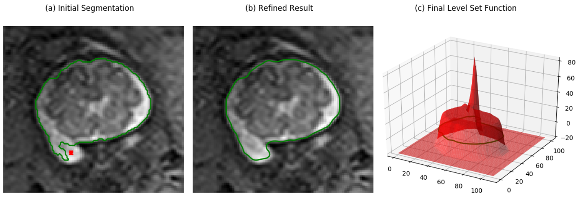

### UGIR: Uncertainty-Guided Interactive Refinement for Segmentation
This repository will provide the code for "Uncertainty-Guided Efficient Interactive Refinement of Fetal Brain Segmentation from Stacks of MRI Slices" accepted by MICCAI 2020. Note that the code has not been fully tested and will be uploaded soon.

The code contains two modules: 1), a novel CNN based on convolution in Multiple Groups (MG-Net) that simultaneously obtains an intial segmentation and its uncertainty estimation. 2), Interaction-based level set for fast refinement, which is an extention of the DRLSE algorithm and named as I-DRLSE. 


Fig. 1. Structure of MG-Net.


Fig. 2. Segmentation with uncertainty estimation.


Fig. 3. Using I-DRLSE for interactive refinement.

### Requirements
Some important required packages include:
* [Pytorch][torch_link] version >=1.0.1.
* [PyMIC][pymic_link], a pytorch-based toolkit for medical image computing. Version 0.2 is required. 
* [GeodisTK][geodistk_link], geodesic distance transform toolkit for 2D and 3D images.
Follow official guidance to install [Pytorch][torch_link]. Install the other required packages by:
```
pip install -r requirements.txt
```

[torch_link]:https://pytorch.org/
[pymic_link]:https://github.com/HiLab-git/PyMIC
[geodistk_link]:https://github.com/taigw/GeodisTK

### How to use
After installing the required packages, add the path of `UGIR` to the PYTHONPATH environment variable. 
### Demo of MG-Net
1. Run the following commands to use MG-Net for simultanuous segmentation and uncertainty estimation. 
```
cd uncertainty_demo
python ../util/custom_net_run.py test config/mgnet.cfg
```
2. The results will be saved to `uncertainty_demo/result`. To get a visualization of the uncertainty estimation in an example slice, run: 
```
python show_uncertanty.py
```

### Demo of I-DRLSE
To see a demo of I-DRLSE, run the following commands:
```
cd util/level_set
python demo/demo_idrlse.py 
```
The result should look like the following.


### Copyright and License
Copyright (c) 2020, University of Electronic Science and Technology of China.
All rights reserved. This code is made available as open-source software under the BSD-3-Clause License.
